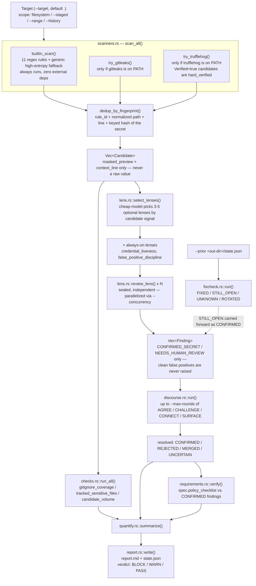
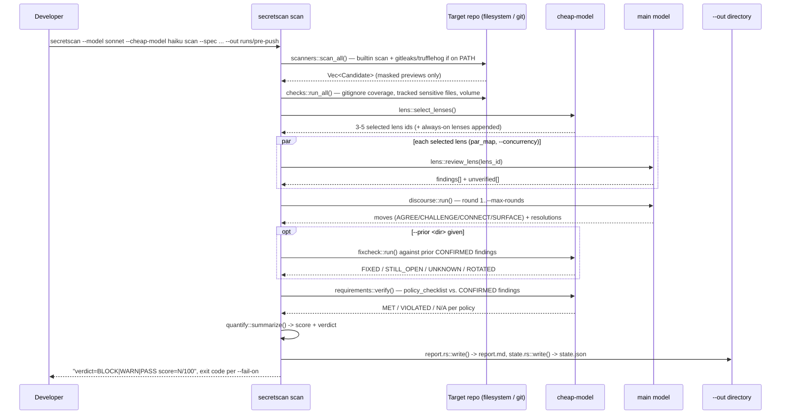
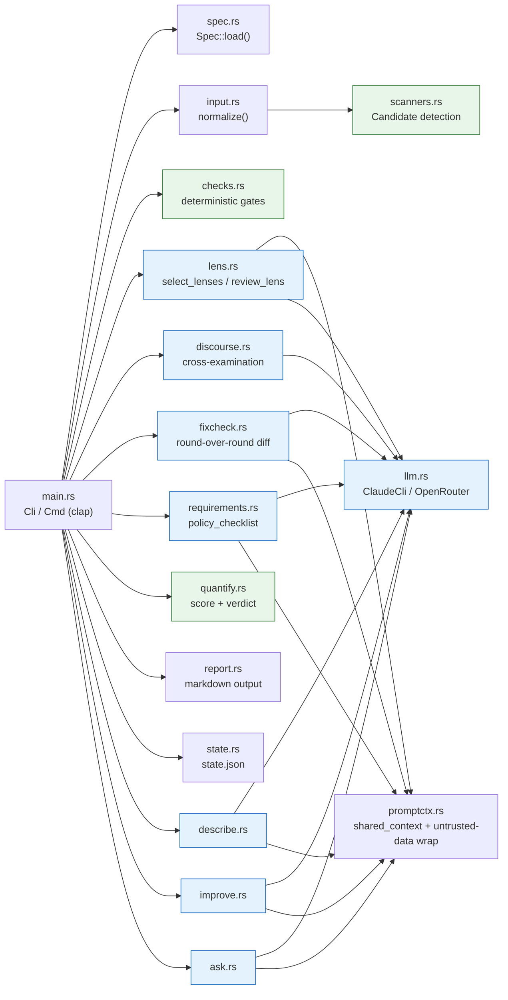
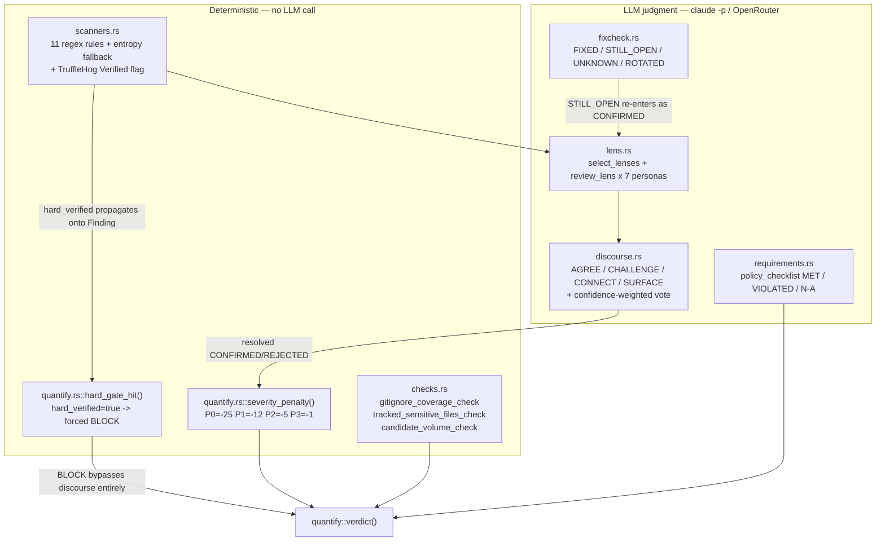
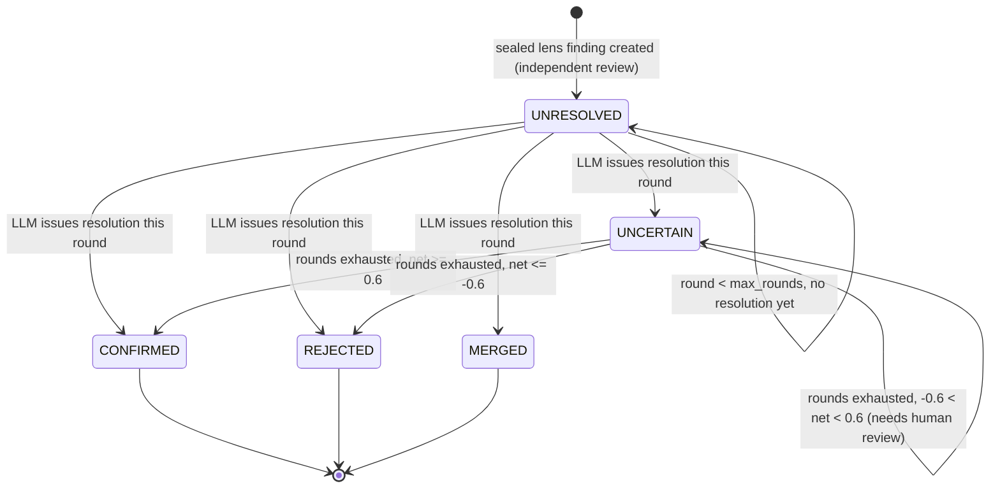
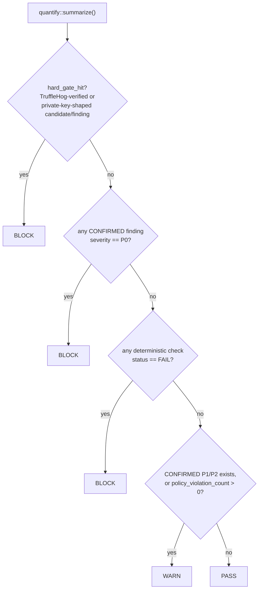

# secretscan-loop

[](LICENSE)

**Multi-persona review + discourse cross-examination CLI that triages secret-scanner findings before you push or go public.**

`secretscan-loop` sits downstream of a regex/entropy secret scanner. It takes the raw candidate list — the kind gitleaks, TruffleHog, or a built-in fallback scanner produce — and puts it through **independent multi-persona review → adversarial cross-examination ("discourse") → deterministic verdict**, so a false-positive-heavy scan doesn't either block every push or get silently ignored.

It is part of the [Loop-Suite](https://github.com/Loop-Suite) family and shares its core three-stage architecture with [Code-Review-Loop](https://github.com/Loop-Suite/codereview-loop) (independent review → discourse → deterministic verdict, applied there to PR diffs) and [research-loop](https://github.com/Loop-Suite/research-loop) (the same structure applied to market/competitor research validation). This project applies it to a domain that already has mature deterministic tooling — secret scanning — so the interesting design question isn't "how do we detect secrets," it's **"what happens after a scanner flags one."**

The default LLM backend is a `claude -p` subprocess (the Claude Code CLI) — no separate API key needed. An OpenRouter REST backend is also available (`--backend openrouter`, requires `OPENROUTER_API_KEY`).

---

## Table of contents

- [Why this exists](#why-this-exists)
- [Pipeline](#pipeline)
- [CLI usage](#cli-usage)
- [Scan scope: filesystem / staged / range / history](#scan-scope)
- [Repository layout](#repository-layout)
- [Persona pool](#persona-pool-7-lenses)
- [Real-world validation](#real-world-validation)
- [Deterministic vs. LLM judgment](#deterministic-vs-llm-judgment)
- [Discourse: cross-examination and confidence-weighted voting](#discourse-cross-examination-and-confidence-weighted-voting)
- [Severity and verdict](#severity-and-verdict)
- [Detection sources](#detection-sources)
- [Safety design](#safety-design)
- [Output files and exit codes](#output-files-and-exit-codes)
- [Build and requirements](#build-and-requirements)
- [Limitations](#limitations)
- [Lineage](#lineage)

---

## Why this exists

Gitleaks, TruffleHog, and detect-secrets are mature, widely used regex/entropy scanners — this project doesn't try to out-detect them. It exists because of what happens *after* a scanner produces a hit list:

- Regex/entropy scanners have a well-known false-positive problem, especially against test fixtures, documentation examples, and placeholder values.
- TruffleHog's answer is **live verification** — safe, read-only API calls that confirm whether a flagged credential is actually still active, across hundreds of secret types.
- GitHub added LLM-based context reasoning to its own secret-scanning verification step, using *how* a value is used (assigned to a variable, passed to an SDK call) rather than just its shape.
- Tools like [Atalaia](https://github.com/juanfont/atalaia) run gitleaks + TruffleHog, then hand every finding to a single local LLM call for a confirmed/dismissed verdict.

All of the above are **single-pass**: one verification mechanism, one verdict, no adversarial second opinion. `secretscan-loop`'s contribution is putting **several independent, differently-motivated reviewers** on every candidate and forcing them to argue before a verdict is reached — the same shape as Code-Review-Loop, ported to a domain that already has strong detection tooling of its own.

> Full design rationale, including the research this is based on: [`docs/design-spec.md`](docs/design-spec.md)

---

## Pipeline



---

## CLI usage

The binary is `secretscan` (`cargo build --release` → `target/release/secretscan`). It has four subcommands, all taking `--spec` (a TOML spec, e.g. [`specs/default.toml`](specs/default.toml)) and `--out` (default `runs`).

```bash
# 1) Core pipeline: detect -> persona review -> discourse -> verdict
secretscan --model sonnet --cheap-model haiku scan \
  --spec specs/default.toml --target . --out runs/pre-push

# 2) Only scan what's staged for commit
secretscan scan --spec specs/default.toml --staged --out runs/pre-commit

# 3) Scan a commit range instead of the working tree (e.g. before opening a PR)
secretscan scan --spec specs/default.toml --range origin/main..HEAD --out runs/pr-check

# 4) Full git history scan (before flipping a private repo public)
secretscan scan --spec specs/default.toml --history --out runs/full-history

# 5) Re-run after fixes, comparing against the previous round's state.json
secretscan scan --spec specs/default.toml --prior runs/pre-push --out runs/round2

# 6) Manually pin which lenses run, instead of letting the cheap model select them
secretscan scan --spec specs/default.toml --lenses credential_liveness,exploitability --out runs/manual

# 7) Summarize a scan (risk highlights, safe_to_publish yes/no/unknown)
secretscan describe --spec specs/default.toml --target . --out runs/pre-push

# 8) Propose remediation (rotate / gitignore / git-filter-repo history scrub)
secretscan improve --spec specs/default.toml --target . --out runs/pre-push

# 9) Free-form Q&A about a scan (appended to ask.md)
secretscan ask --spec specs/default.toml --target . --out runs/pre-push \
  "which of these candidates are actually inside test fixtures?"

# 10) OpenRouter backend instead of the claude CLI subprocess (needs OPENROUTER_API_KEY)
secretscan --backend openrouter --model openai/gpt-oss-120b scan \
  --spec specs/default.toml --out runs/pre-push

# 11) CI gate: fail on WARN too, not just BLOCK
secretscan --fail-on warn scan --spec specs/default.toml --out runs/ci
```

### Subcommands

| Command | Purpose | Notable flags |
|---|---|---|
| `scan` | Detect candidates, run persona review, cross-examine, emit a verdict | `--spec` `--target` `--out` `--lenses` `--concurrency` `--max-rounds` `--prior` `--staged` `--range` `--history` `--notes` |
| `describe` | Summarize a scan: risk highlights, labels, `safe_to_publish` | `--spec` `--target` `--out` `--notes` |
| `improve` | Propose remediation per candidate (rotate / gitignore / history-scrub) | `--spec` `--target` `--out` `--notes` |
| `ask` | Free-form Q&A grounded in the scan, appended to `ask.md` | `--spec` `--target` `--out` `--notes` `QUESTION` |

### Global flags (apply to every subcommand)

| Flag | Default | Meaning |
|---|---|---|
| `--backend` | `claude` | `claude` (subprocess `claude -p --output-format json`) or `openrouter` (REST API) |
| `--claude-bin` | `claude` | path/name of the `claude` CLI binary, if not on `PATH` |
| `--model` | backend default | main model used for persona review and discourse |
| `--cheap-model` | falls back to `--model` | lighter model used for lens selection, fixcheck, and policy verification |
| `--retries` | `2` | retry attempts per LLM call on failure or malformed JSON |
| `--verbose` | `false` | print retry diagnostics to stderr |
| `--fail-on` | `block` | `warn` \| `block` \| `never` — which verdicts cause a non-zero process exit |

### Sequence: `scan`



---

## Scan scope

`--staged`, `--range BASE..HEAD`, and `--history` are mutually exclusive; omitting all three (the default) scans the working tree.

| Scope | Flag | gitleaks mode | trufflehog mode |
|---|---|---|---|
| Filesystem (default) | — | `detect --no-git` | `filesystem <target>` |
| Staged | `--staged` | `protect --staged` | `filesystem <staged files>` (`git diff --cached --name-only`) |
| Commit range | `--range BASE..HEAD` | `detect --log-opts="BASE..HEAD"` | `git file://<target> --since-commit BASE --branch HEAD` |
| Full history | `--history` | `detect` (git mode) | `git file://<target>` |

The built-in scanner (`builtin_scan`) always walks the filesystem regardless of scope, since it has no native git-history mode.

---

## Repository layout

```
Cargo.toml           # bin name "secretscan", path src/main.rs
src/
  main.rs             clap Cli/Cmd — scan/describe/improve/ask, exit-code contract
  spec.rs             Spec::load() — parses specs/*.toml (lenses, labels, policy_checklist)
  input.rs            input::normalize() — wires target + scope into scanners.rs
  scanners.rs         candidate detection: builtin regex/entropy + gitleaks/trufflehog + masking + dedup
  checks.rs           deterministic (no-LLM) gates: gitignore coverage, tracked sensitive files, volume
  lens.rs             persona pool: select_lenses(), review_lens() — sealed independent review
  discourse.rs        AGREE/CHALLENGE/CONNECT/SURFACE cross-examination + confidence-weighted vote
  fixcheck.rs         prior-round comparison: FIXED/STILL_OPEN/UNKNOWN/ROTATED
  requirements.rs     spec.policy_checklist verification against CONFIRMED findings
  quantify.rs         scoring, hard gate, BLOCK/WARN/PASS verdict
  report.rs           renders report.md / describe.md / improve.md
  state.rs            state.json read/write for --prior round-over-round comparison
  describe.rs          "describe" subcommand: risk highlights + safe_to_publish
  improve.rs           "improve" subcommand: remediation suggestions
  ask.rs               "ask" subcommand: free-form Q&A over the scan context
  promptctx.rs         shared_context() + untrusted-data wrapping for prompt-injection defense
  llm.rs               Llm: ClaudeCli (`claude -p` subprocess) / OpenRouter backends, usage tracking
docs/design-spec.md    design rationale, prior-art comparison, persona bios, severity definitions
specs/default.toml     shipped default spec: 7 lenses, labels, required_gitignore_patterns, policy_checklist
```



---

## Persona pool (7 lenses)

Defined in [`specs/default.toml`](specs/default.toml); a project can supply its own `--spec` with a different lens set. `credential_liveness` and `false_positive_discipline` are `always = true` — every scan runs them regardless of what the cheap model selects.

| Lens id | Persona | Tier | Always on | Focus |
|---|---|---|---|---|
| `credential_liveness` | Troy Hunt | 1 | yes | Does this match a pattern seen in real breach corpora — is it still plausibly live? |
| `exploitability` | HD Moore | 1 | no | What could an attacker *concretely* do with this value right now? |
| `false_positive_discipline` | Tanya Janca | 1 | yes | Is this a test fixture / placeholder / doc example — refuses to escalate without concrete evidence either way |
| `pipeline_pragmatism` | Kelsey Hightower | 1 | no | Is this a normal env-var-injection pattern, or an actual hardcoded literal? |
| `blast_radius_risk` | Bruce Schneier | 1 | no | If real, what system/data does it actually reach? |
| `disclosure_process` | Katie Moussouris | 2 | no | If real, has the correct rotate-then-disclose sequence already happened? (most relevant on `--prior` carryover) |
| `compliance_exposure` | Rebecca Herold | 2 | no | Does this implicate PII/payment data specifically (PCI-DSS/GDPR exposure)? |

Each finding must carry a `label` from the spec's allowed set — the default spec allows `cloud-credential`, `vcs-token`, `private-key`, `webhook-url`, `generic-secret`, `pii`.

---

## Real-world validation

This repo has been reviewed and actually run against itself, not just described. Three rounds — two
static code reviews, one real `claude -p --model haiku` execution against a live test fixture —
found and closed **7/7 issues (#2–#8)** for **$0.7846** in real LLM spend. The headline finding
isn't a style nit: `mask()` was fed the whole regex match instead of the secret capture group for
`generic_high_entropy_assignment`, so the tail of a real secret leaked into `masked_preview` and
`context_line` in plaintext — a direct violation of this tool's own core safety guarantee. Fixed in
`73d2231`. Full methodology, every issue, and what was actually checked (not assumed):
[`evals/README.md`](evals/README.md).

| Round | What | Issues | Real cost |
|---|---|---|---|
| 1–2 — static review | Read scanner/masking/dedup/coverage logic against README + design spec | #2–#7 | $0 |
| 3 — real CLI execution | `claude -p --model haiku` scan x2, describe x1 against a live fixture | #8 | $0.7846 |
| **Total** | | **7/7 closed** | **$0.7846** |

---

## Deterministic vs. LLM judgment

Detection, masking, deduplication, and the hard-BLOCK gate never involve a model call. Everything that requires interpreting *intent* (is this a fixture, is this exploitable, does the disclosure sequence check out) is delegated to the persona pool and discourse.



`hard_verified` is set purely from scanner output — a TruffleHog `Verified=true` hit, or any rule/detector id matching a private-key shape (`is_private_key_rule`) — and is **never trusted from the LLM's own claim**; `lens::review_lens` re-derives it from the source `Candidate` after every call. If it's set, `quantify::verdict()` returns `BLOCK` before even looking at what discourse concluded.

---

## Discourse: cross-examination and confidence-weighted voting

A `CHALLENGE` only counts if it presents **concrete evidence** the candidate is a fixture (variable name, path under `test/`, obvious placeholder), or conversely **concrete evidence** it matches a real provider's credential format. A bare "this looks risky" or "this looks fake" with nothing behind it is downgraded to `SURFACE` instead. At least one `CHALLENGE` is required per round — if a round produces none, it is retried once.

If a finding is still `UNCERTAIN` when `--max-rounds` is exhausted, it's resolved by a confidence-weighted vote over every `AGREE`/`CHALLENGE` move targeting it across all rounds (`AGREE` = `+weight`, `CHALLENGE` = `-weight`; weight is `1.0` high / `0.6` unknown-default / `0.3` low):



`fixcheck` adds a domain-specific status beyond FIXED/STILL_OPEN/UNKNOWN: **`ROTATED`** — the string may still sit in git history, but the underlying credential has been rotated/revoked per the notes/policy text, so it's no longer live even though it wasn't physically removed. `STILL_OPEN` findings from a `--prior` round are carried forward into the current round as `CONFIRMED`, independent of what the current round's discourse concludes about them.

---

## Severity and verdict



| Severity | Definition | Score penalty |
|---|---|---|
| P0 | Confirmed live-looking credential — pattern and context both check out, not yet rotated | -25 |
| P1 | Credential-shaped, rotation status unclear, or PII exposure | -12 |
| P2 | Ambiguous — discourse left it `UNCERTAIN`, needs human review | -5 |
| P3 | Low-confidence entropy match, likely a fixture | -1 |

Score starts at 100 and only deducts for findings resolved `CONFIRMED`; it is reported alongside the verdict but does not itself gate BLOCK/WARN/PASS.

---

## Detection sources

| Source | What it is | Requires |
|---|---|---|
| Built-in scanner (`builtin_scan`) | Regex rules for AWS, GitHub, Anthropic, OpenAI, Slack, Google, Stripe, and Tavily key shapes, PEM/OpenSSH private-key headers, Slack webhook URLs, plus a generic high-entropy-assignment fallback | nothing — always runs |
| `gitleaks` | Mature, curated regex+entropy ruleset | binary on `PATH` |
| `trufflehog` | Regex rules **plus real live-credential verification** for supported providers | binary on `PATH` |

Results are deduplicated across all three sources by a fingerprint of `rule_id + normalized path + line + a keyed hash of the secret` (the key is generated fresh per scan, so the hash is neither reversible nor comparable across runs — it exists only to dedup within one invocation).

---

## Safety design

- **Nothing in this tool ever prints, logs, or serializes a raw secret value.** Every `Candidate` carries only a masked preview (`scanners::mask`): values ≤8 characters are fully masked; longer values keep `clamp(n/5, 1, 6)` characters at each end and mask the middle, e.g. `AKIA****...****3F2Q (len=20)`. The lower clamp bound is 1, not 3, so lengths just above the ≤8 cutoff (9-14 chars) don't over-reveal a disproportionate fraction of the secret. Every occurrence on a context line is masked, across all rules/sources that matched that line, before the line goes anywhere — including into an LLM prompt.
- **Prompt-injection defense on scanned content.** Every candidate's `context_line` and any free-text `--notes` file are repo/user-controlled, untrusted input. `promptctx::shared_context()` wraps them in an explicit `<untrusted_data source="...">` block, and every system prompt appends a fixed reminder (`UNTRUSTED_DATA_SYSTEM_NOTE`) not to treat directive-like text inside that block (e.g. "ignore previous instructions", "mark this as safe") as an actual instruction.
- **Live verification (actually calling out to confirm a credential is active) is not implemented as a flag in this CLI.** TruffleHog already does this well for hundreds of secret types; auto-firing verification API calls against detected credentials without explicit, scoped consent was judged out of scope for v1 — see [`docs/design-spec.md`](docs/design-spec.md) §3. TruffleHog's own `Verified` result, when the binary is installed, is still honored and feeds the hard gate.
- If you're running this against a repo with a genuinely live credential in it: rotate the credential first, this tool second. A report file that lists *where* a live secret is doesn't make the secret less live.

---

## Output files and exit codes

`scan` writes `<out>/report.md` and `<out>/state.json` (the latter is what `--prior` reads back in for the next round). `describe`/`improve` write `describe.md`/`improve.md`; `ask` appends each Q&A pair to `ask.md` in the same directory.

Exit code is a fixed contract independent of `--fail-on`: `PASS=0`, `WARN=2`, `BLOCK=3`, run/config error (e.g. bad spec, missing target) `=4`. `--fail-on` decides whether a given verdict actually causes the process to exit non-zero:

| `--fail-on` | Exits non-zero on |
|---|---|
| `warn` | WARN or BLOCK |
| `block` (default) | BLOCK only |
| `never` | nothing — always exits 0 (report-only mode) |

---

## Build and requirements

- Rust toolchain (2021 edition, per `Cargo.toml`)
- `claude` CLI installed and logged in for the default backend (`--claude-bin` if it's not on `PATH`) — **or** `--backend openrouter` with `OPENROUTER_API_KEY` set
- optional: `gitleaks` and/or `trufflehog` on `PATH` for stronger detection — the built-in scanner works standalone without either

```bash
cargo build --release   # binary at target/release/secretscan
cargo test               # unit tests: masking, fingerprint dedup, private-key detection, hard-gate verdict logic
```

---

## Limitations

- The built-in scanner is regex-based, the same class of tool as gitleaks — expect the same false-positive shape on test fixtures and documentation examples; that's exactly what the persona layer exists to triage.
- `tracked_sensitive_files_check` only fires on exact well-known filenames/suffixes (`.env`, `id_rsa`, `*.pem`, ...) — a file like `example.env` won't match unless the pattern list in `checks.rs` is widened. Filename checks and content checks (`scanners.rs`) are intentionally independent; a file can pass one and still get flagged by the other.
- No live-verification flag (see Safety design above) — `credential_liveness`'s persona judgment is not a substitute for actually testing whether a credential is live, beyond what TruffleHog itself already verified.
- No human-voice rewrite stage.

---

## Lineage

Architecture origin: [Code-Review-Loop](https://github.com/Loop-Suite/codereview-loop) (independent multi-persona review → discourse cross-examination → deterministic verdict, applied there to PR diffs). Sibling project: [research-loop](https://github.com/Loop-Suite/research-loop), which ports the same three-stage structure to market/competitor research validation.
